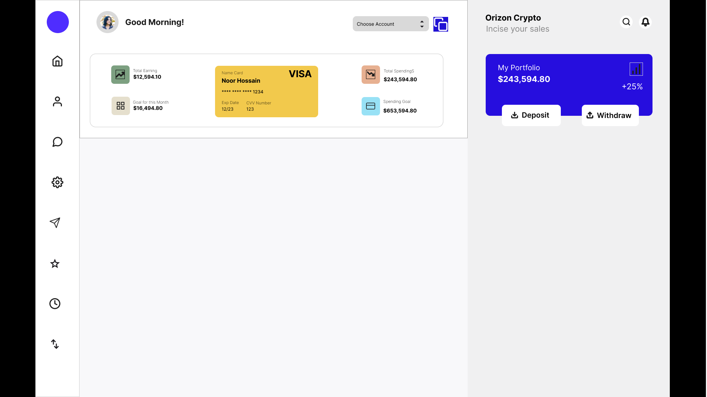

# 💳 Banking Dashboard UI

A modern banking dashboard UI designed using Figma.

## 📌 Overview

This project is a clean and modern banking dashboard interface created in Figma. It presents account information, spending statistics, and financial goals in a user-friendly and visually appealing layout.

## ✨ Features

- Modern banking dashboard
- VISA card component
- Total earnings & spending cards
- Monthly goal tracking
- Clean and minimal UI
- Responsive layout concept

## 🛠️ Tool Used

- Figma

## 🔗 Figma Design

Paste your Figma share link here.

## 📷 Preview

